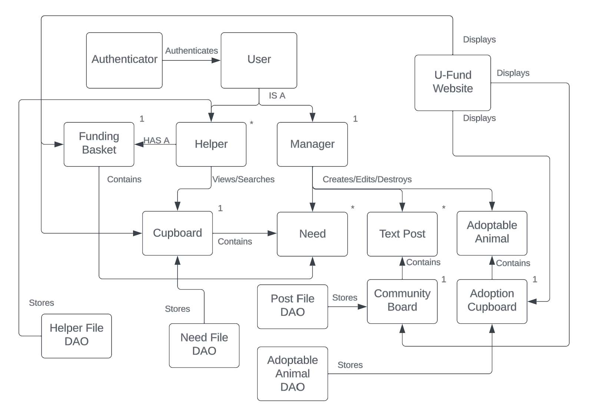
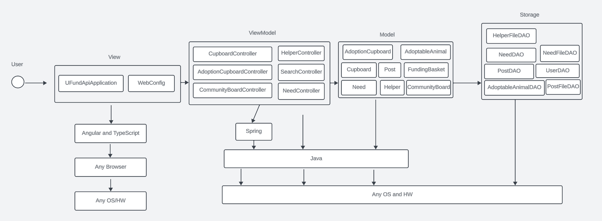
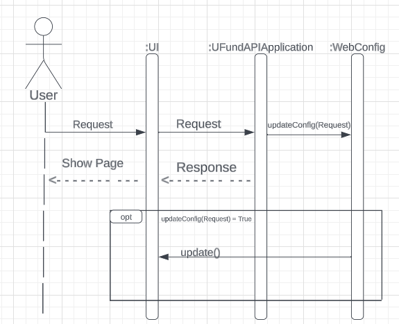
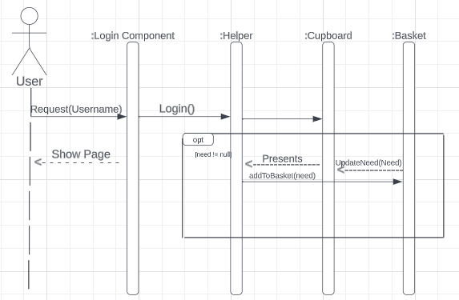
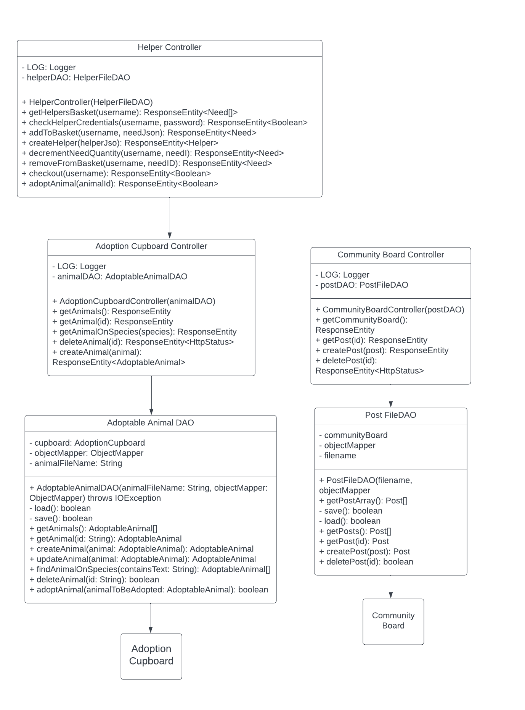
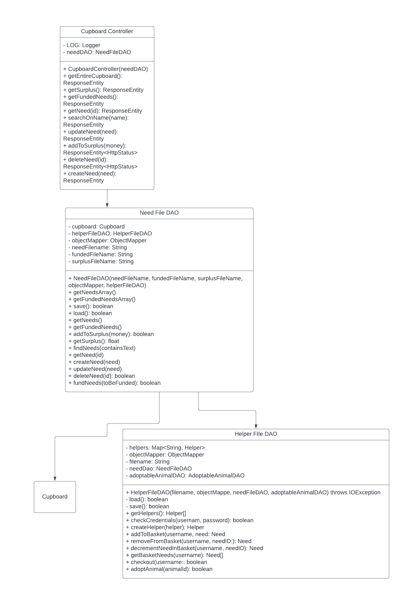
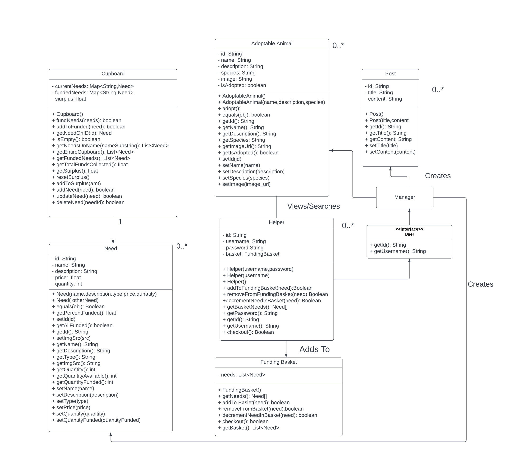

# ANIMAL AUXILIARIES Design Documentation

## Team Information
* Team name: 2231-swen-261-05-2b-animal-auxiliaries
* Team members
  * Chase Balmer
  * Sarah Payne
  * Marisa Ortiz
  * Tyler Combs 
  * Tszfai Choy

## Executive Summary

This project is a U-Fund website that is to be used by a local animal shelter/humane society. This website provides tools for a welcoming and supportive community with the purpose of helping homeless animals. Managers run the needs page, indicating the current needs of the organization. This may include funding equipment purchases, purchasing food, etc. Helpers may view these needs and contribute through funding. Helpers can also view an adoption board (created/updated by a manager) and start the process of adoptiong an available animal. We hope that our product will enable members of our community to help these innocent animals and provide them with the things they need, or even a home. The websites backend is built in Java-Spring, the frontend with Angular. 

### Purpose

Our U-Fund website exists to serve small local animal shelters that are in need of a low-cost accessible form of fundraising. Our top goal is to create a website that is accessible and easily navigable to an average community in order to crowd fund for a non-profit through the average person. 

### Glossary and Acronyms

| Term | Definition |
|------|------------|
| Need | A single item or action that the non-profit needs to be funded. Needs are **created** by *Managers* and **funded** by *Helpers*. |
| Cupboard | Virtual storage for the many needs of the non-profit. The cupboard is **edited** by *Managers* and **viewed** by *Helpers*. | 
| Funding Basket | Virtual shopping basket. Each *Helper* has a personal Funding Basket, they can **add** and **remove** *Needs* from their Funding Basket as well as **Check-out** or buy those *Needs*. | 
| Manager | A website User that represents a person who is responsible for the needs of a non-profit. The Manager has the ability to **edit** the *Cupboard*. | 
| Helper | A website User that represents a person who is donating to the non-profit. The Helper has the ability to **search** the *Cupboard* and **fund** *Needs*. They also have the ability to view both community board posts and adoptable animals, and **adopt** animals not on hold| 
| Adoptable Animal | A single animal that is in the adoption cupboard, who is either adoptable or on hold(not adoptabke) |
| Adoption Cupboard | Virtual board of adoptable animals |
| Community Board | Virtual list of text pagraphs **posted** by managers for helpers to view |
| Post | Individal text paragraph posted in community board by a manager |
| Adoption Cupboard | Secondary cupboard viewable by Helpers and editable by Managers containing Adoptable Animals | 

## Requirements
Webpage displaying and enabling all of the following things:

Authentication for Helper/U-fund Manager login & logout will enable necessary privledges for a user. 

Helpers have the following abilities:
  Helper can see list of needs.
  Helper can search for a need.
  Helper can add/remove a need to their funding basket.
  Helper can checkout their funding basket.

Managers have the following abilities:
  Manager(s) can add, remove and edit the data of all their needs stored in their needs cupboard.
  U-fund Manager cannot see contents of funding basket(s).

Data Persistence
  The system saves all information to files so that changes are reflected for all users. 

Your 10% additional feature enchantment(s)
  Adoption Site 
  Community Board

### Definition of MVP
- **Minimal Authentication** --> Minimal Authentication allows any user to login to the website without creating an account. Any user attempting to login with the **admin** username will be logged in as a *Manger*. Any user attempting to login with any other username will be logged in as a *Helper*. 

- **Helper Functionality** --> Minimal Helper Functionality allows the *Helper* to **search** for a *need*. As well as **Add** and **Remove** *Needs* from their *Funding Basket*. 

- **U-fund Manager Functionality** --> Minimal Manager Functionality allows a *Manager* to **add**, **remove**, and **edit** the *needs* in the *cupboard*. And prevent the *Manager* from viewing the *funding baskets*. 

### MVP Features

| Epic | User Stories | 
|------|--------------|
| User Management | User Authentication, Manager Abilities, Helper Abilities | 
| Funding Basket | Add need to basket, Remove need from basket, checkout funding basket | 
| Frontend Angular | Home Page, Manager Page, Helper Page, Basket Page | 
### Enhancements
**Community Board**   
The Community Board displays text posts that are posted/deleted by managers. This is viewed on the login page. The hope is for managers to use this to communicate important/timely information and create a tight-knit environment.  
  
**Adoption Board** 
The Adoption Board displays a board of adoptable animals that helpers can view. The animals on the board are managed by a manager. Helpers see the board and can elect to start the adoption process on an animal if it is available. If the process is started on an animal, that animal will be labeled as on hold and will be unadoptable by other users. We assume the actual adoption process would be in person/not on the website, so this board is more of a means to research the animal and begin that process of adoption. This enhancement creates a strong identity for our site and provides the ultimate means to help the non-profit.

## Application Domain

This section describes the application domain.

## Architecture and Design
This section describes the application architecture.

### Summary

The following Tiers/Layers model shows a high-level view of the webapp's architecture. 

The web application, is built using the Model–View–ViewModel (MVVM) architecture pattern. 

The Model stores the application data objects including any functionality to provide persistance. 

The View is the client-side SPA built with Angular utilizing HTML, CSS and TypeScript. The ViewModel provides RESTful APIs to the client (View) as well as any logic required to manipulate the data objects from the Model.

Both the ViewModel and Model are built using Java and Spring Framework. Details of the components within these tiers are supplied below.

### Overview of User Interface

This section describes the web interface flow; this is how the user views and interacts with the web application.

The application opens on a login page 'http://localhost:4200/login', logging in as an admin will take the user to the manager page 'http://localhost:4200/manager'; logging in as a helper takes you to the helper page 'http://localhost:4200/helper']

Once on the manager page the user sees a 'logout' button at the top of the page was a create need textbox and a list of needs in the cupboard underneath the logout button and a heading 'My Needs'. A manager can create a need by entering a name into the 'Need name: ' labeled text box and clicking the 'Add need' button, this adds the need to the list of all needs underneath. The list of needs displays the need names which link to a 'Need detail' page as well as an 'x' button which will delete the need from the cupboard. The 'Need detail' page displays the name, description, type, price, quantity, and quantity funded properties of the need in editable text boxes. The manager can update the values of the need properties by editing the boxes and clicking the 'save' button, or discard their changes by clicking the 'go back' button. 

Once on the helper page the user sees a 'logout' button above a search box with all of the cupboard needs listed below displaying yhe need name, description, price, and quantity propoerties as well as a '+' button that when clicked will add the need to the helper's funding-basket. Below the list of all needs in the cupboard is a list of all needs inside of the helpers funding-basket where the needs are displayed in the same way as they are in the cupboard except with a '-' button which will remove the need from the helper's funding-basket. 

### View Tier
The View Tier UI of our architecture uses two key components. Those being the UFundAPIApplication and our WebConfig. As the user interacts with our UI the API acts as the interpreter for those requests. Then if the API requests any changes be made to the UI it calls upon the WebConfig to make those modifications on the fly allowing flexability and a quick response time.

### ViewModel Tier
The View Model tier of our architecture consists of 10 components. They are NeedDAO, NeedFileDAO, PostDAO, PostFileDAO, UserFileDAO, AdoptableAnimalDAO, HelperController, CupboardController, CommunityBoardController, and AdoptionCupboardController. This diagram has a repeating sequence among the DAOs, FileDAO, and Controller. The FileDAOs are all based on the architecture of their respective DAOs. Then once created the DAOs parse their respective JSON files into values that can be passed to their respective controllers. Essentially the DAOs act as the bridge between the data stored in the JSONs and the controller which is in charge of changing this data and keeping track of it.

### Model Tier
Our model tier consists of 7 main elements; Cupboard, Need, Helper, Adoptable Animal, Funding Basket, Post, and User. Starting at the beginning if a user is a Helper or manager they have access to a few different things. Helper's may add Needs to their funding basket from the cupboard to be checked out and funded. Helpers may also view and adopt animals and also view posts. If a user is a manager they have access to create these things. Managers may create posts, needs, and adoptable animals.

## OO Design Principles
**Sprint 1 Champion Principles**

*Single Responsibility* 
- During Sprint 1 our team focused on keeping our classes single responsibility. This means keeping classes as small as possible ad ensuring that every class or object we create should only do one thing.
- Our cupboardController is a good implementation of a single responsibility class; its only job is manipulating the needs in the cupboard. It does not hold the logic for doing these things, its only responsibility is to call the correct methods to make the manipulations happen.
- When adding the enchancements during Sprint 3, we added two more controller classes. The adoptionCupboardController was made with the sole responsibilty of handling the adoptionCupboard and adding/removing adoptableAnimals from the cupboard. The communityBoardController was similar in that it was responsable for handling Posts made and added to the communityBoard.These controllers helped us keep our classes small and efficient

*Controllers*
- During Sprint 1 our team focused on the controllers design principle. Controllers handle user input/actions and interact with the models and views. They facilitate communication between the user interface and the underlying system components.
- The controller principle is applied in our design by separating the user interface from the business logic of the application.
- Our cupboardController is a good example of a controller class in our code; it handles adding/removing/edting needs in the cupboard
- Across Sprint 2 and 3, we continued to use controllers as nessesary to keep the logic of the application far from the user interface. For every major component, a controller was made to help organize and streamline code and logic.

**Sprint 2 OO Design Principles** 

*Information Expert*
-  During Sprint 2, our team focused on making our Need and Cupboard classes 'information experts'. These classes have methods that can be called to find the states of their many properties. 
- The Cupboard class has many methods that support searching functionality, so that our cupboardController class can call cupboard methods with search terms and only recieve back needs that fit the search, rather than requesting the full cupboard and having to search through it itself every time. 
- The Need class has many methods that describe the standing of the need in terms of quantity available and quantity funded. While they were not used during this sprint as we haven't yet completed our checkout basket functionality, these methods will be useful by alowing the Need object itself to state if it is avaiable to be checked out rather than another class having to deal with the logic of deciding it.

*Open/Closed*
- During Sprint 2 our team focused on making our Users Open/Closed, meaning that they are 'open for extension, but closed for modification'. 
- Our team wrote a User interface to be used when creating types of Users for our website. While at the moment our team has only implemented the User interface in the creation of the Helper class, in future sprints we see the possibility of including different types of users that will have different abilities and the User interface will be an ideal place to start in creating those new Users. 
- We continued using interfaces across the project, especially within the persistance tier. These DAO interfaces creating a jumping off point for creating classes that extended them and also prevented us from adding more than what was nessasary to these classes. It kept our code from getting bloated and difficult to read through.

**Sprint 3 OO Design Principles**

*Low Coupling*
- During Sprint 3, our team focused on how classes interacted with eachother and consistently questioned whether one class was holding too much responsability. We focused on low coupling as a way to ease production and maintainability of the code as well as making the code easier to understand.
- Because we all worked simultaneously and we all wrote code meant to interact with another person's, low coupling was of greater importance so that we could make the learning process and implementation of different code easier. Low coupling can easily be observed across all tiers, but specifically in the model tier where we seperated the communityBoard class from the Post class. This low coupling allowed for the communityBoard to act as a holder for the posts made by the Post class instead of having it do both which would cause confusion and difficulty when it came to properly implementing the code.

*Pure Fabrication*
- In our goal to improve our applications design, we chose to focus on Pure Fabrication as another prinicple in Sprint 3. Our team believed it to be important not only as a way to achieve further Low Coupling but as a way to simplify more complex systems in our application.
- In the persistance tier, we made interfaces to be implemented into classes in order to help outline everything the class needed to complete. While these DAO interfaces weren't directly tied to the domain, they served as helpers to help connect classes together 

## Static Code Analysis/Future Design Improvements
  

**Issue 1 - Cognitive Complexity**

This issue surrounds the cognitive complexity of helperFileDAO's removeFromBasket function. The complexity is 21, 6 over the 15 alloted complexity. The problem is that the method is very complex and hard to understand, making maintenance difficult. I believe this issue may appear in some other similar methods from this class. These methods were hard to streamline because we were contstantly updating and changing the logic of how they worked. We would recommend going back into the code and refactoring the approach. Breaking the method into pieces would be very effective here, as removeFromBasket contain multiple steps that could be seperated into different methods. This would signifigantly increase the readability and ability to maintain this code.   

**Issue 2 - Public Test Methods**
This issue does not need photo context. We are recieving low risk messages for basically every test we have written instructing us to remove the public modifier from the test methods. The 'why' reads as follows: "JUnit5 is more tolerant regarding the visibilities of Test classes than JUnit4, which required everything to be public. In this context, JUnit5 test classes can have any visibility but private, however, it is recommended to use the default package visibility, which improves readability of code." This appears to be a very small issue and in our opinion is not hurting us in any way. Our code has these tests with the public modifier as our main unit test resource was from the heroes-api project, which has all public test methods. This is likely due to the code being written prior to JUnit 5. With that being said, it would not hurt us to go in and remove all of these public modifiers.   

**Issue 3 - List Item**

This issue appears because we have a list item outside of a list container. This is a small but notable issue. It does not make sense for the code to be this way and could confuse a developer. A person looking at this for the first time may thing the code was not finished or had bugs in it. This could be quickly fixed by going in and placing the item inside a unordered list block.   

**Issue 4 - Missing Generic Font**

This issue is regarding a lack of including a generic font. Multiple of our css sections for font styles do not include a generic font to fall back on. This results in a situation where if a browser does not support the fonts listed, the css will fall back on the browsers default font. This could cause a worse outcome if this situation were to occur. It would be suggested to include generic fonts to fall back on where we would still be pleased with the stlye if this situation were to occur. 

## Future Refactoring
If the team had additional time for improvement, there would definitely be some changes made. When it comes to the logic of our code, we are very pleased and proud of the product we put out. We feel we met the requirements and had logic that functioned at intended. This in saying the changes on the backend we would like to make are not logic focused, rather simplification and efficiency based. There are defintely some methods that could use streamlining or refactoring to make code more readable and efficient(see static code analysis issue 1). We also would like to have been able to scrub through the code and update comments, remove things that no longer are needed or relevant, and polish the classes.   
In regards to the front end, we are also happy with the look and feel. Some comments from other teams indicated some minor inconsistencies with margins and white space. It was also suggested to us in the usability review that we update some of the small button animations and polish the look of the manager page and need page. These fixes are not focused on the way it works, rather the spacing and locations on the page. These suggested fixes are pretty small, but they are definitely things we would like to implement.   
To wrap up these thoughts, we were very happy with our project, but would like to make finishing touches on some aspects of the site and really add a final polish. 

## Recommendations for Improvement 
# Software Architecture 
Our cohesion wasn't perfect on the frontend as there were elements we deemed too insignificant for us to create it's own individual componenet class. For example, we decided not to break down various the homepage into too many parts. We decided not to break down the homepages' components such as the community board, the brief description and the login section as weren't going to reuse it in other sections of our website.  
When given the chance, we would like to focus on adopting a component-based architecture, breaking down UI elements into reusable components irrespective of immediate use or reusability which will ensure scalability and assist with maintenance. 

# Usability [Front End] Changes
Based on usability feedback, the website needs some fixes on the strategic use of color and texture. Our reviewers suggested changing all text colors to white (currently black) to make the text more readable. This is a good suggestion and would likely increase the readability. Another area of usability we could work on is the purposefulness of page layout. It appears that in some locations on the helper and manager page the margins are not always consistent. We could work on developing the spacial relationships and placing emphasis on the more important areas of each page. Another suggestion from our testers was including a message to indicate if a user is a helper or manager; this would mshow the system communicating what has happened after a login. Below are some example fixes we could make to increase our usability. 

**Helper Page**
- Set the need boxes to uniform sizes
- Set the need text to white
  

**Manager Page**
  - Add text to indicate that you are on the admin page

## Testing
All aspects of our testing for sprint 3/4 were fantastic. All acceptance tests were passed and both instructions and branches were above 90% coverage. This was a big step up from sprint 2, where our branch percentage was below 90% and not all acceptance tests passed. The team worked very hard to put a stamp of approval and have our tests reflect our confidence. 

### Acceptance Testing
**Sprint 4 Summary**

Every single user story passed all of its acceptance criteria tests(11). Our application works exactly as we expected and planned for. We did not find any bugs in design during our testing.  

**Sprint 2 Summary**

### Unit Testing and Code Coverage
**[Sprint 3 & 4]**  

Our coverage for sprint 3 and 4 was levels beyond sprint 2. Instructions was at 96% and branches was at 91%.  
Our strategy for unit testing was essentially to test everything and anything. Each time a new feature was implemented, we would test the model, followed by persistence, and finish with the controller. This was the best strategy as it mirrored the order in which code was written and also matched the order of dependency. Our model had the highest percentages as it was the easiest to test. We really wanted to hammer this section and make sure the foundation for our code was strong. After that, we moved to testing the persistence tier, which was the most difficult. Many of the persistence methods were full of conditions, which made the branch section hard. The team worked through all of the possible situations that could occur based on input, and used the tests as a way to determine if code could be refactored and made more efficient. We would then finish with the controller tier, which was also very easy after we truly understood mocking. The reason our testing was so effective was because we attacked each component as its own piece, testing each layer sequentially.  
We hit above our target percentage of 90%. We did not specifically look to ingore certain peices of code, it really just came down to testing everything to the best of our ability. If it became evident one method was very hard to fully cover, we would acknowledge it and come back to it later if needed. Although we did put a lot of focus on the model, I believe be chose to treat everything equally as we believed that would promote the best coverage in the end, which was reflected.  

**Sprint 2**

